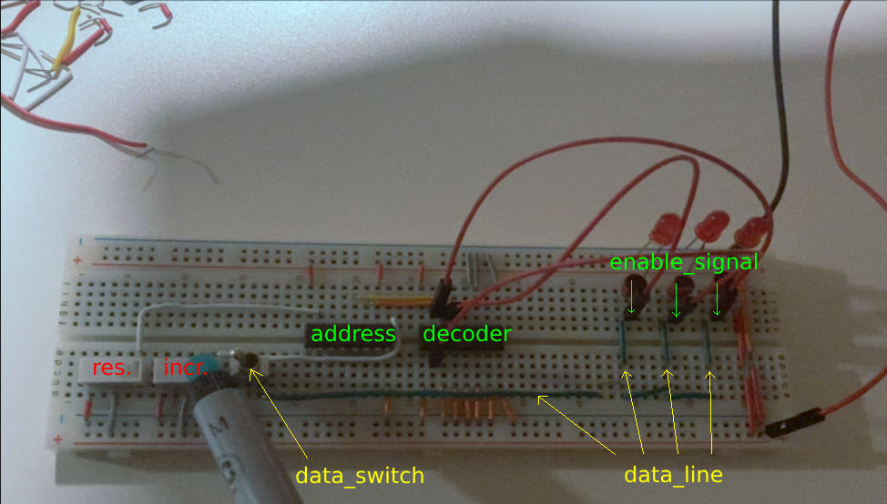

# Studies
###### _What and where I study._

 

### [Pneumatic](https://github.com/r00m3/Studies/tree/main/Pneumatic)
###### _Exercises and experiments using pneumatic/electro-pneumatic components._

 

 

 

 

### [Binary_to_Decimal_Decoder](https://github.com/r00m3/Studies/tree/main/Binary_to_Decimal_Decoder)
###### _Very basic PoC demonstrating binary to decimal decoding on electrical relay blocks._

 

### [MMIO](https://github.com/r00m3/Studies/tree/main/MMIO)
###### _Very basic PoC of Memory Mapped Input Output._

 

 

### [RPI_Pico_LCD_Test](https://github.com/r00m3/Studies/tree/main/RPI_Pico_LCD_Test)
###### _Found LCD screen, followed unofficial documentations to figure out possibilities ._

 
